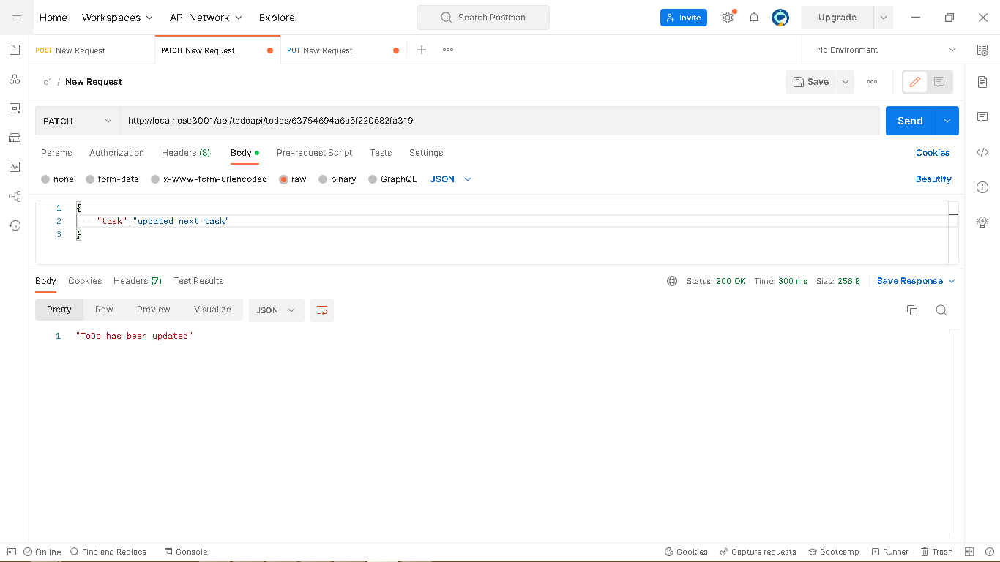
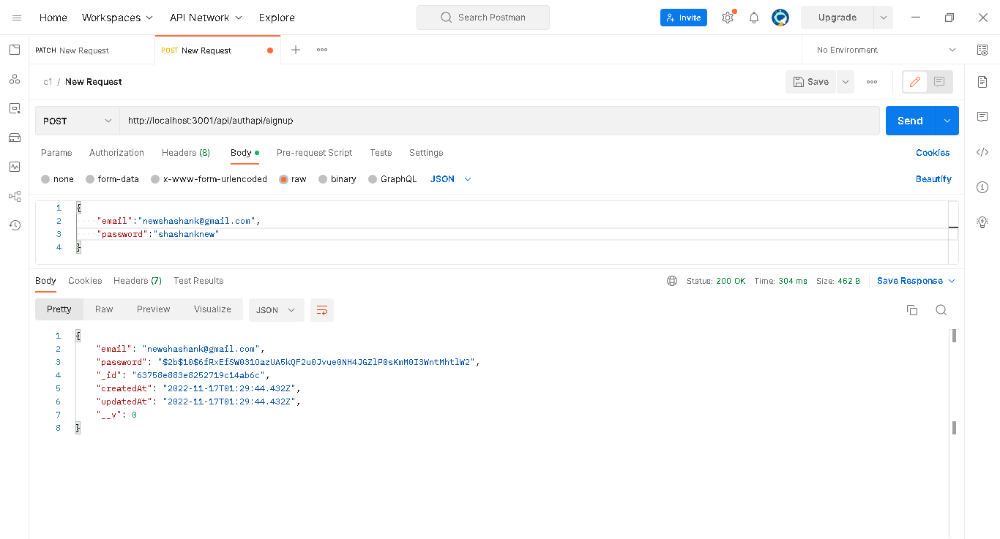
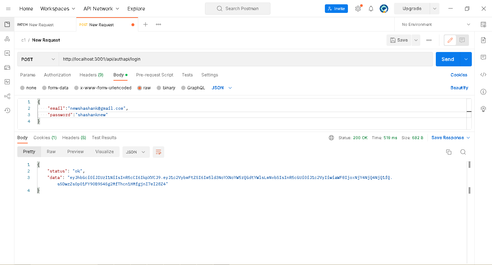

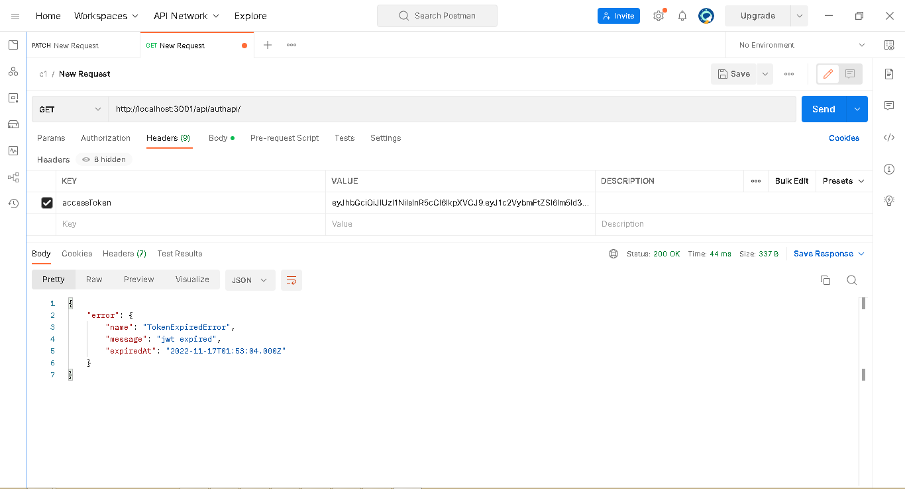
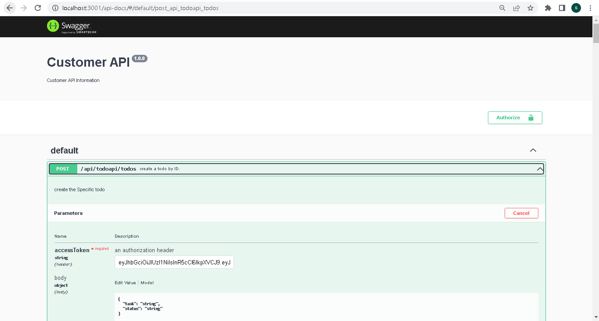
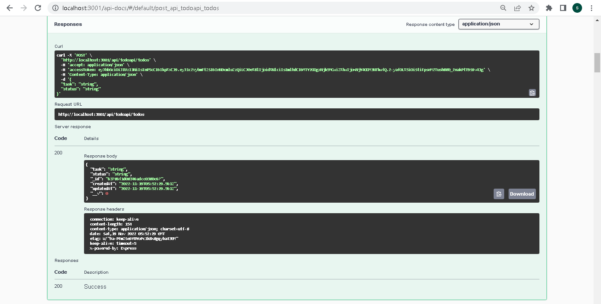
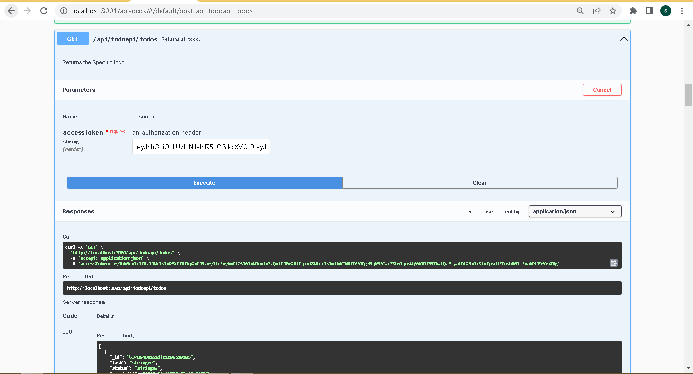
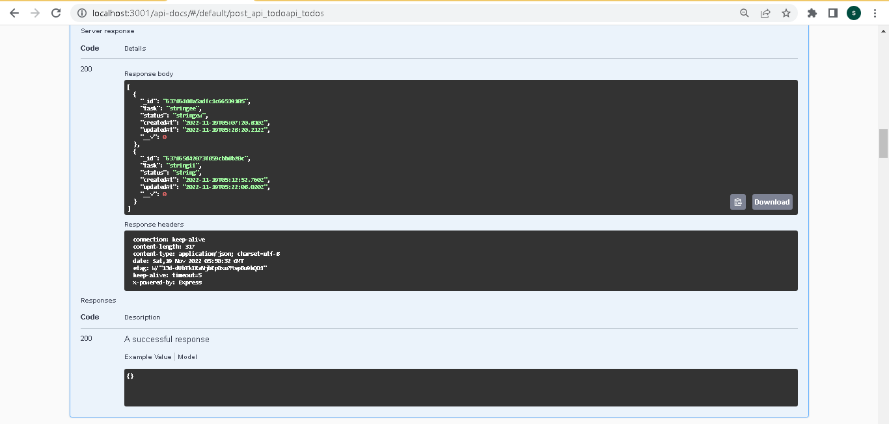
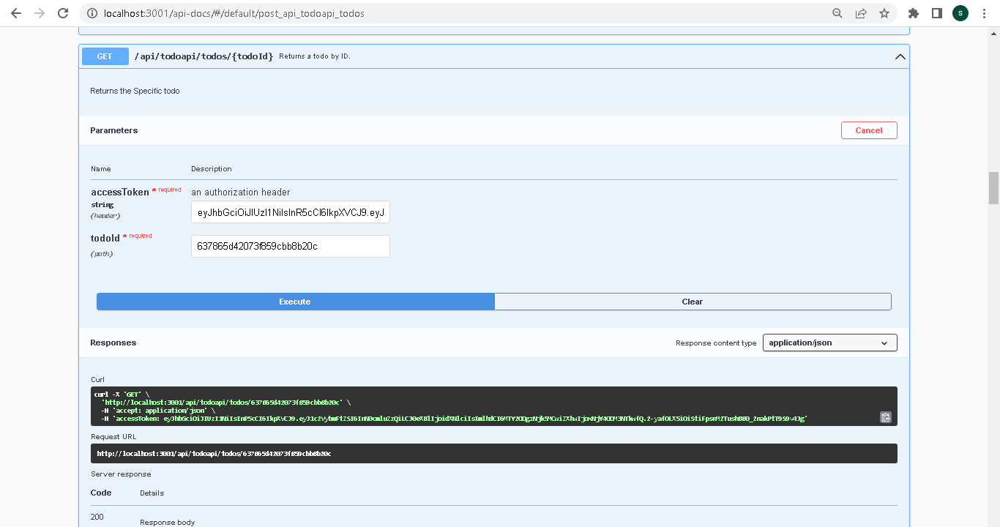

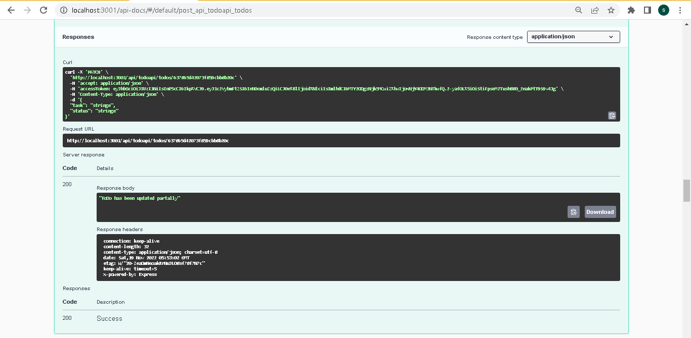
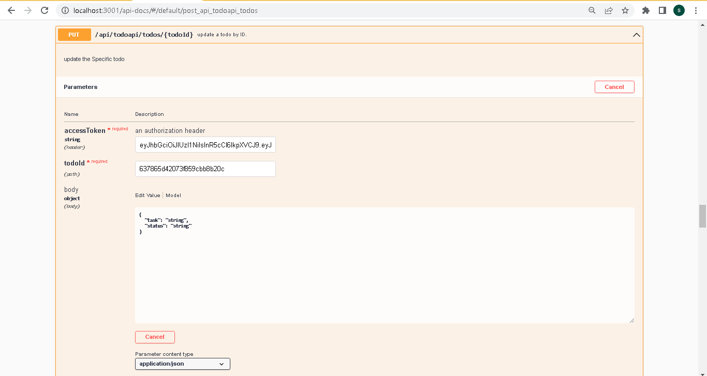
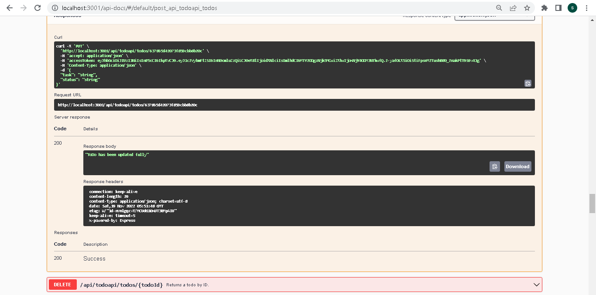
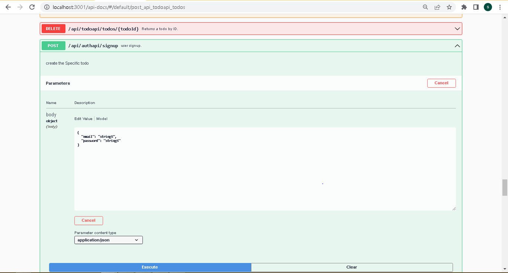
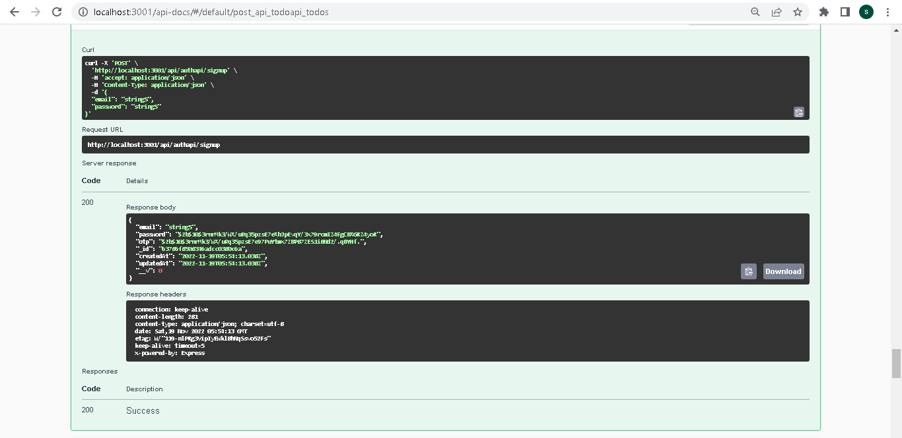
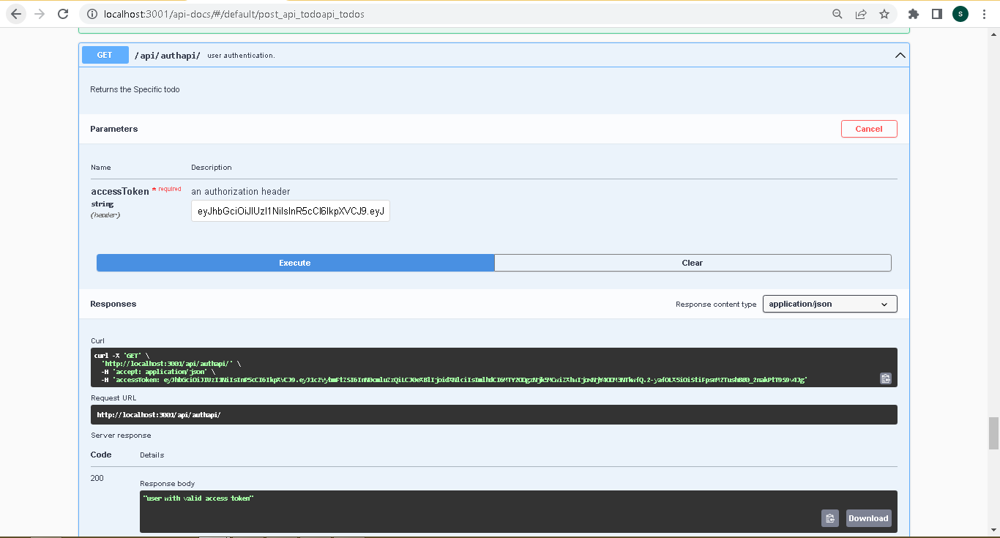
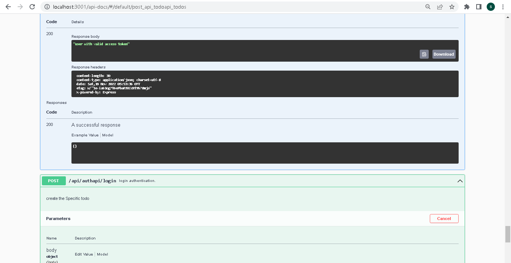

All Tested API NodeJS,MongoDB,Express and Swagger Docuentation for all APIS  
Authentcation with JWT standard(maxAge,cookie,middleware,hashedpassword)  
All Todo Functionalities (put,delete,patch,post,get) 
Swagger Documentation for All Apis 